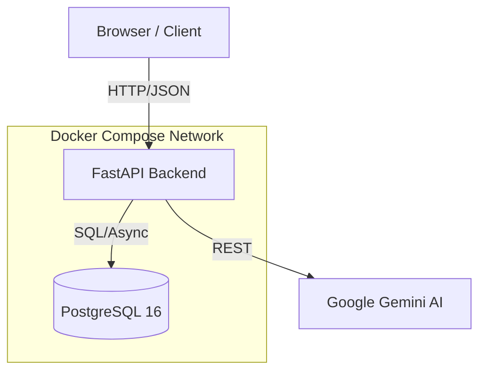

# Supersonic — AI-Assisted Project Planner

An intelligent project planning tool that enables teams to import project plans, manage tasks through a modern UI, and interact with a project-aware AI assistant powered by **Google Gemini**.

Built for professional deployment using **FastAPI**, **PostgreSQL**, and **Docker**.

## 🚀 Features

- **Project plan import** — Upload `.csv` or `.xlsx` files to create a project with tasks in one step
- **Project & task management** — Full CRUD with filtering by status, priority, and date range
- **AI Assistant** — Project-aware chatbot for summaries, risk analysis, and tactical suggestions
- **Modern UI** — Responsive dashboard with priority-coded tasks and inline editing
- **Ethics & policy** — Built-in endpoint documenting data handling and AI limitations
- **Security** — JWT Bearer token auth with bcrypt password hashing

## 🏗️ Architecture



| Component | Technology | Role |
|---|---|---|
| **Backend API** | FastAPI + Uvicorn | REST/JSON endpoints, auth, file parsing, AI orchestration |
| **Database** | PostgreSQL 16 | Persistent storage for users, projects, tasks, messages |
| **ORM** | SQLAlchemy 2.0 (async) | Data models, async DB access via asyncpg |
| **Auth** | python-jose + passlib | JWT token issuance/verification, bcrypt password hashing |
| **File import** | pandas + openpyxl | Parses CSV and Excel uploads into structured project data |
| **AI service** | Google Gemini 2.0 | Reasoning engine for chat, summaries, and suggestions |
| **Deployment** | Docker Compose | Two-container setup (backend + postgres) on a shared network |

## 📊 Data Model

```
User ──1:N──▶ Project ──1:N──▶ Task ◀──N:M──▶ Tag
                 │                │
                 └──1:N──▶ Message (optionally linked to a Task)
```

## 🔌 API Endpoints

| Group | Endpoints | Auth |
|---|---|---|
| **Auth** | `POST /auth/register`, `POST /auth/login`, `GET /auth/me` | public (register/login) |
| **Projects** | `POST /projects`, `GET /projects`, `GET/PUT/DELETE /projects/{id}` | Bearer token |
| **Import** | `POST /projects/import` (multipart file upload) | Bearer token |
| **Tasks** | `POST/GET /projects/{id}/tasks`, `GET/PUT/DELETE /tasks/{id}` | Bearer token |
| **Messages** | `POST/GET /projects/{id}/messages` | Bearer token |
| **AI** | `POST /ai/summary`, `POST /ai/chat` | Bearer token |
| **Policy** | `GET /policy` | public |
| **Health** | `GET /health` | public |

Full interactive docs available at `/docs` (Swagger UI) when the server is running.

## 📂 Project Structure

```
app/
├── main.py                  # FastAPI app, router registration, DB init
├── api/
│   ├── deps.py              # get_db, get_current_user dependencies
│   └── routes/
│       ├── auth.py           # register, login, me
│       ├── projects.py       # CRUD + import
│       ├── tasks.py          # CRUD with filtering
│       ├── messages.py       # create, list
│       ├── ai.py             # summary, chat
│       └── policy.py         # ethics/security policy
├── core/
│   ├── config.py            # pydantic Settings (reads .env)
│   └── security.py          # password hashing, JWT
├── db/
│   ├── base.py              # SQLAlchemy declarative base
│   ├── models.py            # User, Project, Task, Tag, Message
│   └── session.py           # async engine + session factory
├── schemas/                 # Pydantic request/response models
├── static/                  # Frontend UI (HTML, CSS, JS)
└── services/
    ├── ai_client.py         # Gemini AI interface
    └── project_importer.py  # Excel/CSV parser
```

## 🛠️ Quick Start

```bash
# 1. Clone the repo
git clone https://github.com/em-ech/supersonic.git
cd supersonic

# 2. Setup environment variables
cp .env.example .env
# Edit .env and add your GEMINI_API_KEY

# 3. Build and run with Docker
docker-compose up --build

# 4. Open the App
# Dashboard: http://localhost:8000
# API Docs: http://localhost:8000/docs
```

## 🔑 Environment Variables

| Variable | Description | Value (example) |
|---|---|---|
| `DATABASE_URL` | Async PostgreSQL connection string | `postgresql+asyncpg://user:pass@db:5432/db` |
| `SECRET_KEY` | JWT signing key (change in production) | `(random-secret)` |
| `GEMINI_API_KEY` | Google AI Studio API Key | `AIza...` |
| `ACCESS_TOKEN_EXPIRE_MINUTES` | Token lifetime | `60` |

## ⚖️ Security & Policy

- **bcrypt hashing** — Passwords are never stored in plaintext.
- **JWT isolation** — All project data is scoped to the authenticated owner.
- **Dedicated DB User** — PostgreSQL accessed via a restricted service account.
- **AI Disclaimer** — Built-in policy advising users on model limitations and data handling.

---
*Ready for submission. Built for professional software development.*
